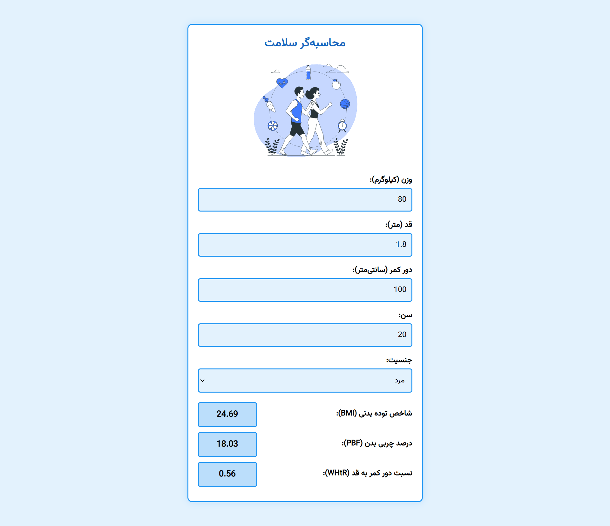

# محاسبه‌گر سلامت


<div style="max-width: 700px; margin: auto; direction: rtl;" align="center">

<table>
    <tr>
      <th></th>
      <td width="500px" align="right">
        پروژه‌ی محاسبه‌گر سلامت، یک وب‌اپلیکیشن ساده برای محاسبه‌ی شاخص‌های مهم سلامتی مانند 
        <b>BMI</b> (شاخص توده بدنی)، 
        <b>PBF</b> (درصد چربی بدن) و 
        <b>WHtR</b> (نسبت دور کمر به قد) است. <br><br>
        این پروژه با استفاده از 
        <b>HTML ،CSS و JavaScript</b> پیاده‌سازی شده است و به کاربر اجازه می‌دهد اطلاعات مورد نیاز را وارد کرده و 
        <b>به‌صورت زنده</b> نتایج را مشاهده کند.
      </td>
    </tr>
  <tbody>
    <tr>
      <th colspan="2" text-align="center">
        <div align="center">
            ✅ برای استفاده از این محسابه‌گر، کافی است وارد 
        <a href="https://foratik.github.io/Health-Calculator/" target="_blank"">این آدرس</a> شوید.
        </div>
      </th>
    </tr>
  </tbody>
</table>

</div>

</br>

----

## گزارش پروژه با تمرکز بر نمایش زنده‌ی نتایج

### قرار دادن فرمول‌ها در کد HTML

ابتدا فرمول‌های مدنظر را با استفاده از تگ formula در فایل HTML می‌نویسیم. در این پروژه فرمول‌های مربوط به چند شاخص بدنی زیر مورد بررسی قرار گرفتند:

</br>

$$BMI = \frac{weight}{height \times height}$$

$$PBF = (1.2 \times BMI) + (0.23 \times age) - (10.8 \times gender) - 5.4$$

$$WHtR = \frac{waist}{height \times 100}$$

رابطه‌های گفته شده را به صورت زیر در کد HTML خود قرار می‌دهیم:
```HTML
<div class="outputs">
    <div class="output-group">
        <label>شاخص توده بدنی (BMI):</label>
        <formula id="bmi" data-formula="weight / (height * height)"></formula>
    </div>

    <div class="output-group">
        <label>درصد چربی بدن (PBF):</label>
        <formula id="pbf" data-formula="(1.2 * (weight / (height * height))) + (0.23 * age) - (10.8 * gender) - 5.4"></formula>
    </div>

    <div class="output-group">
        <label>نسبت دور کمر به قد (WHtR):</label>
        <formula id="whtr" data-formula="waist / (height * 100)"></formula>
    </div>
</div>
```


### بررسی عملکرد تابع `evaluateFormulas`

تابع `evaluateFormulas` وظیفه دارد مقادیر ورودی را دریافت کرده، آن‌ها را اعتبارسنجی کند، فرمول‌های محاسباتی را اعمال کند و در نهایت نتایج را در صفحه نمایش دهد. در ادامه، این تابع را بخش‌بندی کرده و هر قسمت را توضیح می‌دهیم.


 - **دریافت مقادیر ورودی از فرم**

  در ابتدای تابع، مقادیر ورودی از فیلدهای موجود در صفحه دریافت می‌شوند. استفاده از `()trim` باعث می‌شود که فضای خالی اضافی در ابتدا و انتهای مقدار حذف شود تا مقدار پردازش‌شده دقیق باشد.

  ```js
  const weight = document.getElementById("weight").value.trim();
  const height = document.getElementById("height").value.trim();
  const waist = document.getElementById("waist").value.trim();
  const age = document.getElementById("age").value.trim();
  const gender = document.getElementById("gender").value.trim();
  ```

-  **بررسی اعتبار ورودی‌ها**


قبل از انجام محاسبات، باید اطمینان حاصل کنیم که ورودی‌ها معتبر هستند. برای این کار، از یک **تابع اعتبارسنجی** استفاده می‌کنیم که بررسی کند آیا مقدار ورودی یک عدد معتبر است یا خیر. این کار را با قطعه کد زیر انجام دادیم.

```js
function validateInput(value) {
    return /^-?\d*\.?\d+$/.test(value);
}
```
  پس از دریافت مقادیر، این بخش بررسی می‌کند که آیا حداقل یکی از ورودی‌ها خالی یا نامعتبر است یا نه. برای این کار از متد `some` استفاده شده است که اگر یکی از مقادیر درون آرایه خالی باشد یا مقدار نامعتبری داشته باشد، مقدار `isInvalidInput` برابر `true` می‌شود.

  ```js
  const isInvalidInput = [
      weight, height, waist, age, gender
  ].some(value => value === "" || !validateInput(value));
  ```

 - **اجرای محاسبات روی تمامی فرمول‌ها**
  
در این قسمت، ابتدا تمامی المان‌های `<formula>` که در HTML برای نمایش خروجی‌ها تعریف شده‌اند، انتخاب شده و یک حلقه `forEach` روی آن‌ها اجرا می‌شود. مقدار اولیه result به صورت خالی تعریف شده و کلاس error از فرمول حذف می‌شود تا اگر قبلاً خطایی وجود داشته، برطرف شود.

  ```js
  document.querySelectorAll("formula").forEach(formula => {
      const formulaId = formula.id;
      let result = "";
  
      formula.classList.remove("error");
  ```
-  **اعتبارسنجی و جایگذاری مقادیر در فرمول**

اگر مقدار `isInvalidInput`  برابر با `true` باشد، مقدار result به `ورودی نامعتبر` تنظیم می‌شود. در غیر این صورت، مقدار فرمول از ویژگی `data-formula` در تگ `<formula>` خوانده می‌شود. سپس مقادیر دریافت‌شده از کاربر درون این فرمول جای‌گذاری می‌شود. ابتدا مقدار نهایی با استفاده از `()eval` به صورت زیر محاسبه می‌شد:

```js
try {
    if (isInvalidInput) {
        result = "ورودی نامعتبر";
    } else {
        const formulaString = formula.getAttribute("data-formula");

        const formulaWithValues = formulaString
            .replace(/weight/g, weight)
            .replace(/height/g, height)
            .replace(/waist/g, waist)
            .replace(/age/g, age)
            .replace(/gender/g, gender);

        result = eval(formulaWithValues).toFixed(2);
    }
```
در این قسمت، `eval` مقدار رشته‌ای فرمول را به یک معادله ریاضی تبدیل کرده و مقدار آن را محاسبه می‌کرد اما **استفاده از `eval` خطرات امنیتی دارد**، زیرا می‌تواند کد جاوا اسکریپت اجرایی را مستقیماً اجرا کند. یک روش ایمن‌تر برای جایگزینی `()eval` استفاده از `()Function` است و برای همین آن را جایگزین `()eval` کردیم.

محاسبه با استفاده از `()Function`:
```js
const formulaFunc = new Function("weight", "height", "waist", "age", "gender", `return (${formulaString});`);
result = formulaFunc(weight, height, waist, age, gender).toFixed(2);
```

### اجرای محاسبات به‌صورت زنده

برای اینکه محاسبات به‌صورت زنده انجام شوند، باید هر تغییری در ورودی‌ها باعث اجرا شدن تابع `evaluateFormulas` شود.

```js
document.querySelectorAll("input, select").forEach(input => {
    input.addEventListener("input", evaluateFormulas);
});
```
